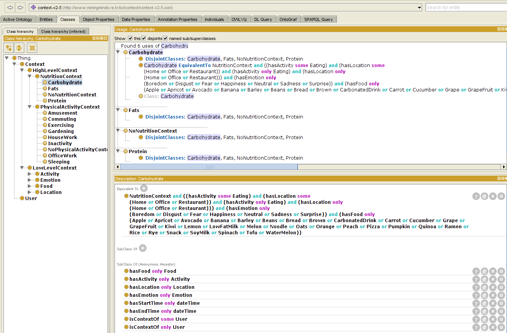

# High Level Context Awareness: (HLCA)
<!-- make your own badges from here: http://shields.io/ -->

--------------------------

<!-- Update the list and the main body. -->

- [1. Introduction](#1-introduction)
    - [1.1 Core Implementation](#11-core-implementation)
   
- [2. Getting started](#2-getting-Started)
    - [2.1 General Requirements](#21-general-requirements)
    - [2.2 Installation](#22-installation)
    - [2.3 Usage](#23-usage)
	
- [3. Features](#3-features)
   
- [4. Contributions](#4-contributions)
   
- [5. Author](#5-author)

- [6. License](#6-license)

<!-- Main Body of the Document -->

# 1. Introduction

In Mining Minds the sensory data is modelled ontologically in the form of RDF Triples.  The Mining Minds Context Ontology (MMCO) models context for human behavior identification in order to enable the provision of personalized health and wellness services in Mining Minds. Since many researchers have proposed widely-accepted definitions of context, and through this interpretations of context have arisen.  In Mining Minds, human context is understood as any information characterizing the physical, mental and social situation of a person which enables the identification of human behavior.  Furthermore, human context is here categorized into two different levels of abstraction: low-level context (LLC) and high-level context (HLC).  HLC has further two main classes, Physical Activity high level context (PA-HLC) and nutrition high level context (N-HLC).  
	-	You can have a look at [MMCO V2.5 how it is designed](http://www.miningminds.re.kr/lifelog/context/context-v2.5.owl) in [Protégé] (http://protege.stanford.edu/) .  
	-	Also It can be visualized in the Screenshot as under 
		

This  MMCO  ontologies with [owlapi](http://owlapi.sourceforge.net/) and ingests ontology formats available to owlapi (OWL, RDF, etc).  MMCO addresses following goals.

Goals:
* OWL 2 Support
* Provide a simple, usable, MMCO representation for multi-model contexts
* Efficient, Extendable MMCO 
* Provide basic "vocabulary" support
* Reasoning support

## 1.1 Core Implementation

The main project developed is Java based exploiting Bridge and Singleton Design Patterns in Maven project.

## Intent & Applicability for Bridge Design Pattern
In the Bridge design pattern we decouple an abstraction from its implementation so that the two can vary independently.  
* We avoided permanent binding between an abstraction and its implementation.
* Both the abstractions and their implementations are extensible by subclassing. This implementation of Bridge pattern allows to  combine the different abstractions and implementations and extend them independently
* changes in the implementation of an abstraction has no impact on clients
* Shares an implementation among multiple objects and fact remains hidden from the client. 

## Intent & Applicability for Singleton Design Pattern
Ensured that a class only has one instance, and provide a global point of access to it.  We also used singleton design pattern so that 
* there must be exactly one instance of a class, and it must be accessible to clients through authorized access point
* the instance is only extensible by subclassing without modifying their code.

			
# 2. Getting Started

This consist of the following sub-headings. 

## 2.1 Requirements

The requirements for executing HLCA are as under:
- Java version: JDK 1.8 
- Maven: Apache-maven-3.2.2

## 2.2 Installation
- Java and JDK setup
	JDK and JAVA_HOME
	*	Make sure JDK is installed, and “JAVA_HOME” variable is added as Windows environment variable
- Apache Maven Installation
	*	Download Apache Maven and install it
	*	Visit Maven official website, download the Maven zip file,
		for example : apache-maven-3.3.9-bin.zip. Unzip it to the folder you want to install Maven.
		(Assume you unzip to this folder – C:\Program Files\Apache\maven)
	*	Add MAVEN_HOME
	*	Add  MAVEN_HOME variables in the Windows environment, and point it to your Maven folder.
	*	Add to PATH
	*	Update PATH variable, append Maven bin folder, so that you can run the Maven’s command everywhere.
	*	Verification by running  mvn –version in the command prompt.
-Build Project
	*	Once you have Maven installed, verify with:
		mvn -version
  		Then run (once) this to download all the necessary dependencies:
	*	Download src and pom file into the appropriate project folder
	*	Start Command Prompt
	*	Change the directory to your project directory and folder
	*	Run “mvn clear install” command
	*	-------------------------------------------------------
	*	You can import the project in Eclipse via File > Import... > Existing Projects into Workspace
	*	You can run mvn eclipse:eclipse to re-generate Eclipse .project and .classpath files automatically from your pom.xml file.
## 2.3 Usage

Once environment has been setup, the user (domain expert) can use this user friendly authoring environment to manage the knowledge base by creating new rules and editing the existing rules. User can 
modify and customize the code according to their requirements. But users should follow the same spring mvc pattern and hibernate framework for updation the code.
*	Add new required table or update the existing table in database "MMIKATDB_V2".
*	Add new or update existing controller under the package "org.uclab.mm.kcl.edkat.controller"
*	Add new or update the existing views according to the requirements under the folder hierarchy src/main/webapp/WEB-INF/views according to followed pattern.

# 3. Features

Write the main features 

- Providing user-friendly environment to expert for transformation of their experiences into knowledge base. 

# 4. Contributions

-	Provide user-friendly Rule Editor to domain experts to maintain the knowledge base. 

# 5. Author

-  Name : Claudia Villalonga and Muhammad Asif Razzaq
-  email : cvillalonga@oslab.khu.ac.kr, asif.razzaq@oslab.khu.ac.kr

# 6. License

Copyright [2016] [Claudia Villalonga and Muhammad Asif Razzaq]

Licensed under the Apache License, Version 2.0 (the "License");
you may not use this file except in compliance with the License.
You may obtain a copy of the License at http://www.apache.org/licenses/LICENSE-2.0
Unless required by applicable law or agreed to in writing, software
distributed under the License is distributed on an "AS IS" BASIS,
WITHOUT WARRANTIES OR CONDITIONS OF ANY KIND, either express or implied.
See the License for the specific language governing permissions and
limitations under the License.
 
